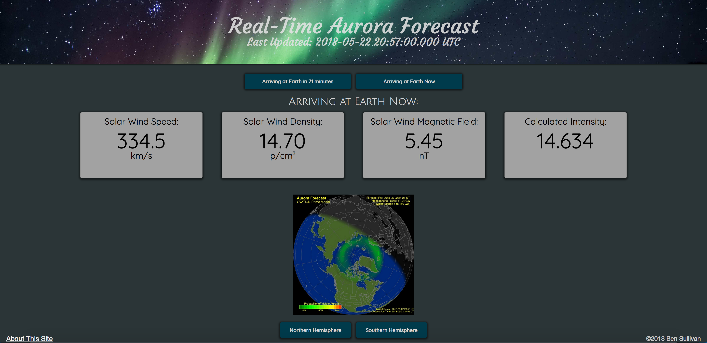

# Aurora Forecast

This app helps people view the aurora borealis by showing the current auroral activity as well as the upcoming activity based on data from the DSCOVR satallite upstream from Earth. Enjoy!

